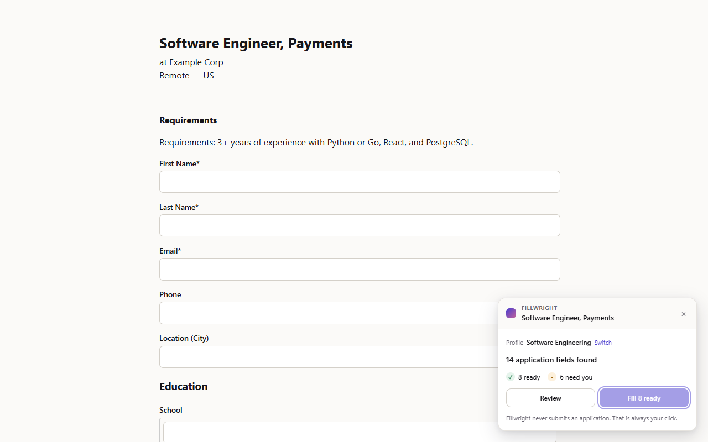
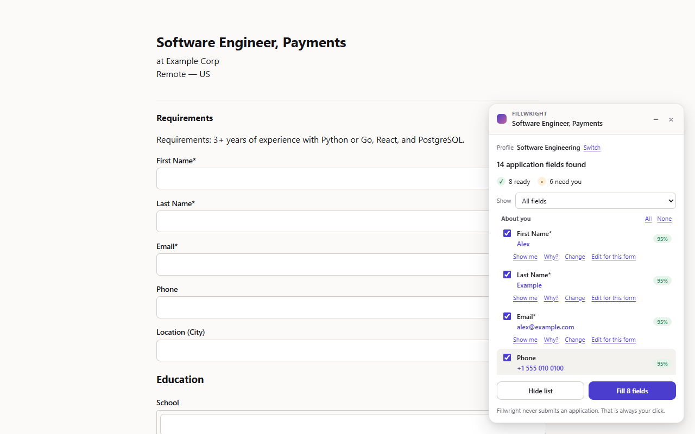
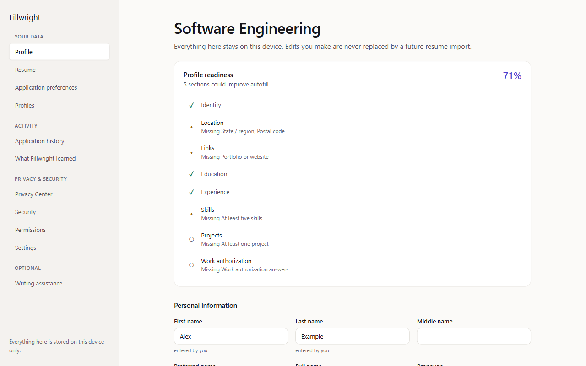
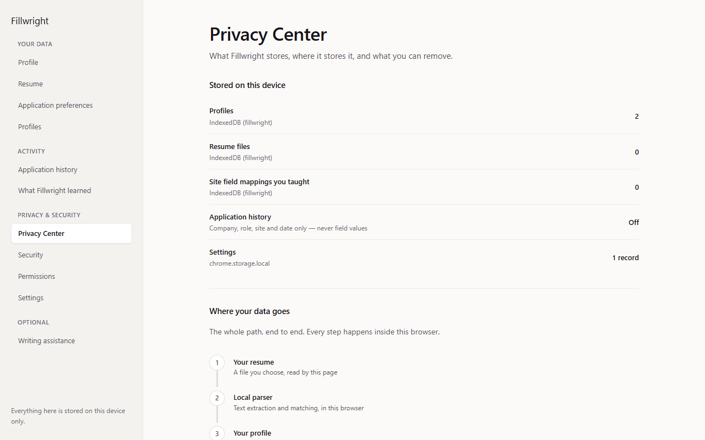
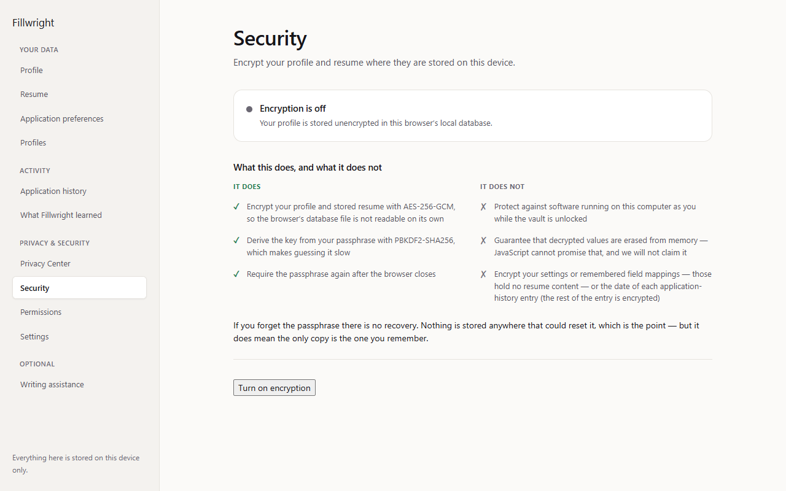

# Fillwright

**Import your resume once. Fill job applications from a profile that never leaves your device.**

Fillwright is a privacy-first Chrome extension (Manifest V3) that reads your
resume locally, builds a structured profile you can edit, and fills application
forms after showing you exactly what it is about to write.

It never submits an application. That click is always yours.

## Screenshots

All five are captured from the real extension by `npm run screenshots`, on local
fixture pages, using an obviously fictional profile ("Alex Example").

| | |
|---|---|
|  |  |
|  |  |
|  | |

---

## What it does

- **Reads your resume on-device** — PDF, DOCX, TXT, drag-and-drop or pasted text.
- **Builds a structured profile** — contact details, education, experience,
  projects, skills, certifications, achievements, languages — with a confidence
  score and a plain-English reason attached to every value.
- **Detects application fields** across Greenhouse, Lever, Workday, Ashby,
  SmartRecruiters, iCIMS, Taleo, Workable, LinkedIn and ordinary career pages,
  using a generic engine rather than per-site scrapers.
- **Shows you a preview** before touching the form, with what changes and why.
- **Fills repeated sections correctly** — "Education #1" and "Education #2" draw
  from different entries, never the same one twice.
- **Drives custom dropdowns** (React Select, Downshift, ARIA comboboxes) by
  opening them and picking the matching option, and refuses when two options fit.
- **Handles split form shapes** — separate month and year selects, a phone
  country-code select beside the number, "I currently work here", and a State
  list that only loads after Country is chosen (offered as "N more fields can
  be filled now", never filled on its own).
- **Verifies every write** and reports what did not take, with a one-click retry.
- **Learns from your corrections.** Tell it what an unrecognised field means and
  it remembers, for that site, on this device only.
- **Reuses what you wrote.** Point a field at one of your custom fields or
  saved answers, and on a written question pick a saved answer (ranked by how
  well it matches) to edit and use. Never chosen for you.
- **Explains itself.** Every row in the review list has a "Why?" that says what
  matched and where, and a "Show me" that points at the field on the page.
  Rows are grouped by section, can be filtered by status, and any proposed
  value can be edited for just this form.
- **Leaves hidden fields alone.** Fields a person cannot see — honeypots,
  off-screen or transparent inputs, fields covered by something else — are
  never filled. The panel says how many it ignored and why.
- **Encrypts what it stores**, optionally, with a passphrase only you hold.
- **Refuses to guess** work authorisation, visa status, demographics, salary or
  criminal history. Those come only from answers you set yourself.
- **Undoes a fill** in one click.
- **Tracks your applications**, if you switch history on: status, notes,
  follow-up dates and CSV export, kept on this device and encrypted with the
  vault.

---

## Install (unpacked)

```bash
npm install
npm run build
```

Then in Chrome:

1. Go to `chrome://extensions`
2. Turn on **Developer mode** (top right)
3. Click **Load unpacked**
4. Select the **`dist/`** folder

Pin Fillwright to the toolbar. First launch opens a five-step setup — import
your resume, check what was read, and fill a practice form — which picks up
where you left off if you close the tab.

To produce a Web Store zip: `npm run presubmit` (runs every check, builds
`release/fillwright-<version>.zip`, then inspects the zip for anything that must
not ship). Listing copy, permission justifications, the privacy-practices
declaration, screenshots and a checklist are in [`store/`](./store).

### Verify the store package yourself

Every release zip is built by CI from a version tag and is reproducible byte
for byte, so you do not have to take it on trust. To check one:

1. Download `fillwright-<version>.zip` and `SHA256SUMS` from the
   [GitHub release](https://github.com/rakshit-737/fillwright/releases).
2. Check the download: `sha256sum -c SHA256SUMS` (PowerShell:
   `Get-FileHash fillwright-<version>.zip -Algorithm SHA256`).
3. Optionally check where it came from:
   `gh attestation verify fillwright-<version>.zip --repo rakshit-737/fillwright`.
4. Rebuild it from source, with Node 22:

   ```bash
   git clone https://github.com/rakshit-737/fillwright.git
   cd fillwright
   git checkout v<version>
   npm ci
   export SOURCE_DATE_EPOCH=$(git log -1 --format=%ct)   # optional: this is the default
   npm run build
   node scripts/package.mjs --out rebuilt
   cat rebuilt/SHA256SUMS
   ```

5. The hash printed by the last step must equal the one in the release's
   `SHA256SUMS`. If it does not, please open an issue.

The zip's entries are sorted, stamped with the tagged commit's time, and
compressed with fixed settings (see `scripts/lib/zip.mjs`). Clone with git
(not a source-archive download) so line endings follow `.gitattributes`, and
use the same major Node version as CI, since deflate output can change with
zlib.

---

## Using it

1. **Options → Resume** — drop in your resume. Everything is parsed on your
   machine; the file is never uploaded.
2. **Review what was read.** Nothing is saved until you confirm.
3. **Options → Profile** — correct anything. An edited field is permanently
   protected: a later resume import will never overwrite it. Email, phone and
   link fields point out likely typos (and add `https://` to links); each
   section can show **what autofill will see**; entries reorder with
   Alt+↑/↓; skills can be pasted as a list.
4. **Options → Application preferences** — set work authorisation, relocation
   and (optionally) demographics and salary (current and expected are kept
   separate and never converted between units). All off and unanswered by default.
5. **On an application**, click the Fillwright toolbar button or press
   `Alt+Shift+F`. A panel appears: "27 application fields found — 21 ready,
   4 to review, 2 need you". It can be dragged (or moved with the arrow keys on
   its title) and minimised with `Esc`.
   Under **Settings → When Fillwright appears** you can choose Assist (it offers
   help on pages that clearly are applications) or Smart (it also prepares the
   plan in advance, as counts only — values are fetched when you open it).
   Both need site access, which Chrome asks you for: job sites only by default,
   a single site from the popup's "Turn on for this site", or every https site
   as a separate step. Settings → Permissions lists and revokes each one.
   Neither fills or submits anything without you. "Fill" becomes active about
   half a second after the panel is fully visible, and pauses if anything on
   the page covers it.
6. **Review, then Fill.** Every row shows what will change, how confident
   Fillwright is, and — behind "Why?" — what it matched on.
7. **Correct anything it got wrong.** "Change" (or "Set what this is") lets you
   pick what a field means — for this form only, or remembered for the site.
   Remembered corrections can be changed, paused, inspected or reset under
   Options → What Fillwright learned.
8. **Multi-entry forms.** Each education/experience block is filled from the
   matching profile entry. If the form shows fewer blocks than you have entries
   and has one clear "Add education" button, the panel offers to add them.
9. **Written questions** are marked "You need to write this". With on-device AI
   switched on, "Draft with on-device AI" shows exactly which facts would be
   used — plus, unticked, an excerpt of the job posting and your saved answers —
   then streams a draft you can cancel at any point (it stops by itself after
   60 seconds and never exceeds the field's length limit). Nothing reaches the
   form until you press "Use this answer". If Chrome still needs its model,
   Settings → Writing assistance has "Download the on-device model" with
   progress.
10. **Job postings.** When the posting is on the page, the panel lists which
    skills it mentions that your profile has, and which it does not. It never
    changes your profile.
11. Check the form, then submit it yourself. Fillwright never submits.

---

## Testing it

```bash
npm test             # 879 unit and integration tests (jsdom)
npm run test:e2e     # 134 end-to-end tests in real Chrome, including axe-core
npm run perf         # performance budget in Chrome for Testing
npm run eval         # classifier and parser accuracy vs tests/corpus/baseline.json
npm run test:coverage # unit tests with coverage thresholds
npm run check        # typecheck → lint → audit → test → build → verify
npm run presubmit    # check + package + inspect the zip
npm run probe:ai     # where Chrome exposes its on-device model
npm run screenshots  # store screenshots, 1280×800
```

`E2E_ONLY=<prefix> node tests/e2e/run.mjs` runs only tests whose names start
with the prefix (after `npm run build:e2e`).

### Performance budget

`npm run perf` builds the test extension and measures it in Chrome for Testing,
failing if any figure is over budget. Measured on Chrome for Testing 131 (median
runs, one Windows 11 laptop), comparing the v0.4.0 tag with this release:

| Measurement | Budget | v0.4.0 | v0.5.0 | v0.6.0 | v0.6.1 |
|---|---|---|---|---|---|
| `content.js` size | ≤ 100 KB | 92.4 KB | 82.0 KB | 120.7 KB | 69.1 KB |
| Inject `content.js`, 50-field form | < 50 ms | 32.4 ms | 21.8 ms | 67.9 ms | 28.0 ms |
| Harvest + classify, `hard-mode.html` | < 120 ms | 8.5 ms | 9.5 ms | 49.5 ms | 13.7 ms |
| MutationObserver callback, 2,000-node burst | < 2 ms | 9.8 ms | < 0.01 ms | < 0.01 ms | < 0.01 ms |

The panel, its stylesheet and the review list moved into `panel.js` (58 KB) in
0.6.1. That file is injected into the frame the first time a panel is shown, so
a page nobody asks about never parses it, and it is not counted above.

The v0.4.0 and v0.5.0 columns were measured on Chrome for Testing 131; the
v0.6.0 and v0.6.1 columns on Chrome for Testing 153, where the v0.5.0 build
measures 81.7 KB, 11.8 ms, 6.4 ms and < 0.01 ms.

The v0.6.1 column is the clean CI runner (the same `node scripts/perf.mjs` the
`browser` job runs), which is what the budgets are set against. The laptop that
produced the v0.6.0 column measures the same 0.6.1 build at 69.1 KB, 61.7 ms,
49.9 ms and < 0.01 ms: its inject and harvest figures carry a fixed overhead
that has nothing to do with the bundle — the 0.6.0 build measures 62.7 ms there
at nearly twice the size.

Passive checks in Assist/Smart mode run at most once every 1.5 s and never
while the page is scrolling (unit-tested in `tests/observe.test.ts`). Timings
vary by machine; the budgets have wide margins on purpose.

### The end-to-end suite

`npm run test:e2e` builds the extension, loads it into Chrome for Testing, and
drives it exactly as a user would — real service worker, real shadow DOM, real
CSP enforcement, real input events. It covers the surfaces jsdom cannot reach:
the panel rendering on a page, filling React-controlled inputs, undo, custom
dropdowns, repeated blocks, and a check that the extension genuinely cannot make
an outbound network request.

This matters more than the test count suggests. The first time it ran it found a
field-mapping bug that 173 jsdom tests had missed, on the most common form layout
there is (see `tests/context-isolation.test.ts`). A later report from real use
found another: importing a **PDF** hung on save, because pdf.js detaches the
buffer it is handed and every test until then had used plain text. Both are now
covered here.

Stable Chrome 137 and later refuse to load unpacked extensions from the command
line, so the suite uses Chrome for Testing, which puppeteer downloads (153 at
the time of writing; run `npx puppeteer browsers install chrome` if it is
missing). Set
`CHROME_PATH` to override. `HEADED=1 npm run test:e2e` runs it visibly.

Local test forms are in `test-pages/`. Serve them over HTTP (extensions cannot
be injected into `file://` URLs without permissions Fillwright deliberately does
not request):

```bash
npx serve test-pages     # then open http://localhost:3000
```

| Page | What it exercises |
|---|---|
| `greenhouse.html` | Labelled inputs, autocomplete attributes, file upload, custom questions |
| `workday.html` | No `<label>` elements at all, `aria-labelledby`, ids with colons and brackets, a collapsed section |
| `react-form.html` | Controlled inputs that revert any write not made through the native setter |
| `edge-cases.html` | Prefilled fields, referee details, credentials, demographics, two-country work authorisation, shadow DOM, dynamically added fields, prompt injection |
| `shadow-labels.html` | Labels inside shadow roots: nested `label[for]`, `aria-labelledby`, a label on the custom-element host, and a document id that must not leak in |
| `draft-posting.html` | A job posting with an injection sentence and a 120-character essay question, for streamed drafting |
| `hard-mode.html` | The regression playground: 50+ controls, repeated education and experience blocks, three custom dropdowns (including one in a portal and one deliberately ambiguous), a field that rejects writes, aria-only labels |
| `ats/greenhouse.html` | Greenhouse job board: `job_application[...]` names, React-Select school and degree, EEO section |
| `ats/lever.html` | Lever: labels in sibling divs, `urls[...]` names, a written "Additional information" |
| `ats/workday.html` | Workday: two steps with Save and Continue, "Add" education blocks, a school search that loads after typing |
| `ats/ashby.html` | Ashby: React-controlled inputs, radio groups built from buttons |
| `ats/icims.html` | iCIMS / SmartRecruiters: the form in a same-origin iframe |
| `ats/linkedin.html` | LinkedIn Easy Apply: a modal with Next / Review / Submit that must never be pressed |
| `virtual-list.html` | A 600-entry virtualised dropdown |
| `spa-steps.html`, `add-another.html`, `one-off.html`, `rejecting.html`, `frame-host.html` | Router navigation, adding blocks, one-off corrections, a form that rejects every write, a form in someone else's frame |
| `saved-answers.html` | A field taught as one of your custom fields; a written question answered from a saved answer only after you confirm |
| `newsletter.html`, `login.html` | Pages that are *not* applications, where proactive modes must stay silent |
| `hostile-roles.html` | Submit buttons and links disguised as dropdowns, options and radios |
| `hidden-fields.html` | Honeypots and six hiding techniques (opacity, off-screen, 1 px clip, `aria-hidden`, `inert`, covered); none may be filled |
| `clickjack.html` | A page that fires synthetic clicks at Fill and covers the panel with a see-through, pointer-events:none overlay |

Every fixture states its expected behaviour at the top of the page.

`edge-cases.html` and `hard-mode.html` state the expected behaviour above each
section; anything else is a bug.

---

## Architecture

```
src/
  types/            Profile, settings, field and message schemas
  parser/           Resume text extraction + structured parsing
    extract/        PDF (pdf.js), DOCX (fflate + WordprocessingML), TXT
  profile/          Factory, merge, completeness scoring
  field-detection/  harvest.ts (DOM → signals) · classify.ts (signals → field)
                    groups.ts (repeated Education #1 / #2 blocks)
  autofill/         resolve.ts (field → value) · plan.ts (safety rules) · fill.ts (writing)
                    combobox.ts (custom dropdowns driven like a person would)
  adapters/         Per-site DOM preparation, tightly constrained
  storage/          IndexedDB wrapper + repositories
  security/         Input validation, scan guard, sensitive-data enforcement
                    crypto.ts + vault.ts (optional encryption at rest)
  ai/               Optional on-device assistance, off by default
  background/       Service worker — sole owner of all persisted data
  content/          Injected script + shadow-root panel
  popup/ options/   React UI
```

### How resume parsing works

Text is extracted per format, then repaired (soft hyphens, line-break
hyphenation, non-breaking spaces). The document is split into sections by a
heading vocabulary, and each section gets a dedicated parser. Every value
carries a confidence score and a reason.

Two rules hold throughout: **nothing is invented** (an unknown field stays
empty), and **nothing sensitive is inferred** — never from a name, a university,
or a location.

For PDFs, pdf.js returns positioned glyph runs rather than lines, so Fillwright
reconstructs lines from baseline positions and re-inserts spacing from the gaps.
Tabs are preserved through parsing because they are the only surviving trace of
a table-like row. Sidebar templates are detected per page: when a vertical
gutter separates two independently flowing columns, the header is read first,
then each column in turn. Links that exist only as clickable words ("LinkedIn |
GitHub") are read from PDF link annotations and DOCX hyperlink relationships;
only `http(s)` targets are kept. Names are matched in any script ("José
Álvarez", "S. R. Jeevan").

### How field detection works

`harvest.ts` reads the DOM into plain data; `classify.ts` is a **pure function**
over that data — no DOM, no network, no model. Signals are weighted by
authority:

```
autocomplete (1.00)  →  <label> (0.97)  →  aria-label (0.93)
  →  name (0.86)  →  id / placeholder (0.80)  →  nearby text (0.62)
```

Independent agreement between signals raises confidence; a close runner-up
lowers it and the field is offered for review instead of filled. Negative rules
matter as much as positive ones — they are what stop "Company Name" being read
as a person's name, or "Confirm Email" as your email address.

Below the confidence threshold (70% by default, adjustable), Fillwright suggests
rather than fills.

**Languages.** Besides English, forms in German, French, Spanish, Portuguese,
Dutch and Italian are recognised. Labels are folded to plain letters first
("Prénom" → "prenom"). The control's `lang` attribute picks the vocabulary
pack; words that are also English ("Note", "Via") count only when the page
declares that language. Sensitive, third-party and company words are
recognised in every supported language regardless, so a German gender question
on a page marked English is still left for you.

### How privacy is achieved

Summarised here; the full threat model is in [SECURITY.md](./SECURITY.md).

- The manifest's CSP pins `connect-src 'self'`, so the extension **cannot**
  make an outbound request. "Nothing leaves your device" is enforced by the
  runtime, not promised in a policy.
- No `<all_urls>`, no declarative content script. Fillwright has no presence on
  a page until you activate it there.
- No analytics, no telemetry, no remote code, no tracking of where you apply.
- The build fails if any of the above stops being true — see
  `scripts/verify-build.mjs`.

---

## Known limitations

1. **Heuristics are heuristics.** Unusual resume layouts and unusual forms will
   sometimes be read wrong. Everything is previewed and editable for this reason,
   and every write is verified afterwards rather than assumed to have worked.
2. **Image-only PDFs cannot be read** — there is no OCR. Paste the text instead.
3. **Files cannot be attached.** Browsers forbid an extension from populating a
   file input. Fillwright flags it and you pick the file.
4. **Closed shadow roots and cross-origin iframes are invisible.** Same-origin
   frames work via per-frame injection. When the form is in a frame from
   another site, the panel says so and suggests opening it in its own tab.
5. **Repeated blocks are matched by heuristic.** Fillwright reads an index from
   the field name (`education[1].school`), a numbered heading ("Education #2"),
   or repeated DOM structure. An unusual layout may still put everything in the
   first block — the preview shows which block each value came from, and a block
   with no matching profile entry is left empty rather than duplicated.
6. **Local device access defeats the storage protections.** See SECURITY.md §3.5.
7. **AI assistance is on-device only.** Hosted models would require relaxing the
   CSP, which would undermine the central guarantee. Drafting runs in the
   service worker. Chrome for Testing 153 exposes `LanguageModel` there (and on
   extension pages, never on web pages) but reports it unavailable on machines
   without the model; 131 does not expose it at all. Generation with a real
   on-device model has not been verified — see `npm run probe:ai`.
8. **Exports are plaintext unless you set a passphrase.** Tick "Protect the
   export with a passphrase" to seal it (PBKDF2 600k + AES-GCM, as the vault);
   forget the passphrase and the file cannot be opened. Without one, the file is
   readable JSON and the page warns before saving it. Imports are shown for
   review first; settings and learned fields from a file start unticked, and an
   imported learned field is only proposed, never pre-ticked, until you confirm
   it on a real form.
9. **Step progress is per tab and per session.** It lives in memory-only
   session storage and resets when the browser closes.
10. **ATS layouts change.** The `test-pages/ats/` fixtures reproduce each
    system's DOM patterns as of this release; they are not copies of the live
    sites, which change without notice.
11. **Searchable dropdowns see a short prefix.** To find an option in a list
    that loads as you type, Fillwright types up to six characters of the value
    into the site's search box, which the site can observe.
12. **Six languages besides English.** Other languages match only through the
    `autocomplete` attribute and English `name` attributes. Work-authorisation
    answers still detect the country from English wording only, so a
    non-English authorisation question is always left for you.

---

## Future work

- Passive detection inside same-origin application iframes (explicit
  activation already covers them).
- A per-site mapping editor that can create rules before visiting the site.
- Verifying drafting against a real on-device model once one is available in
  a testable Chrome build.
- Firefox support (MV3 there differs meaningfully).

---

## Development

```bash
npm run dev         # rebuild on change
npm run typecheck
npm run lint
npm test
npm run icons       # regenerate the PNG icons
npm run check       # everything, in order
```

After a rebuild, press the reload button on `chrome://extensions`.

---

## Licence

MIT. See [SECURITY.md](./SECURITY.md) for the threat model and reporting policy.
